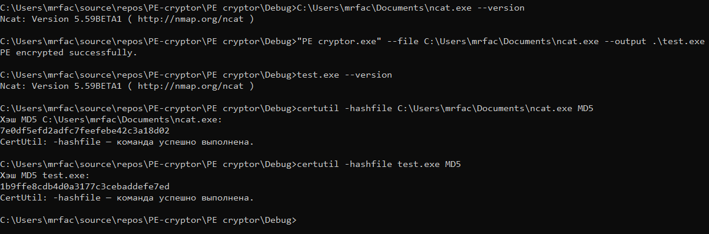

#  Просто криптор PE файлов

Криптор добавляет секцию в PE файл, пишет в неё сгенерированный шеллкод и адреса из таблицы релокаций.
Затем создаёт свою таблицу релокаций (чтобы адреса секций в шеллкоде были правильными) 
и шифрует данные секций однобайтовым ксором. Шеллкод же в свою очередь расшифровывает секции и 
выполняет работу загрузчика с релокациями (берёт адреса , записанные упаковщиком в конец секции 
и добавляет смещение базового адреса образа относительно оригинального).

## TODO:
* Отрефакторить код
* ~~Сделать нормальную работу с памятью в либе~~
* Запилить свой загрузчик, как у всех нормальных упаковщиков
* Сделать шифрование таблицы импорта
* Сделать нормальный алгоритм шифрования
* Добавить антиотладку
* Не забыть это всё сделать